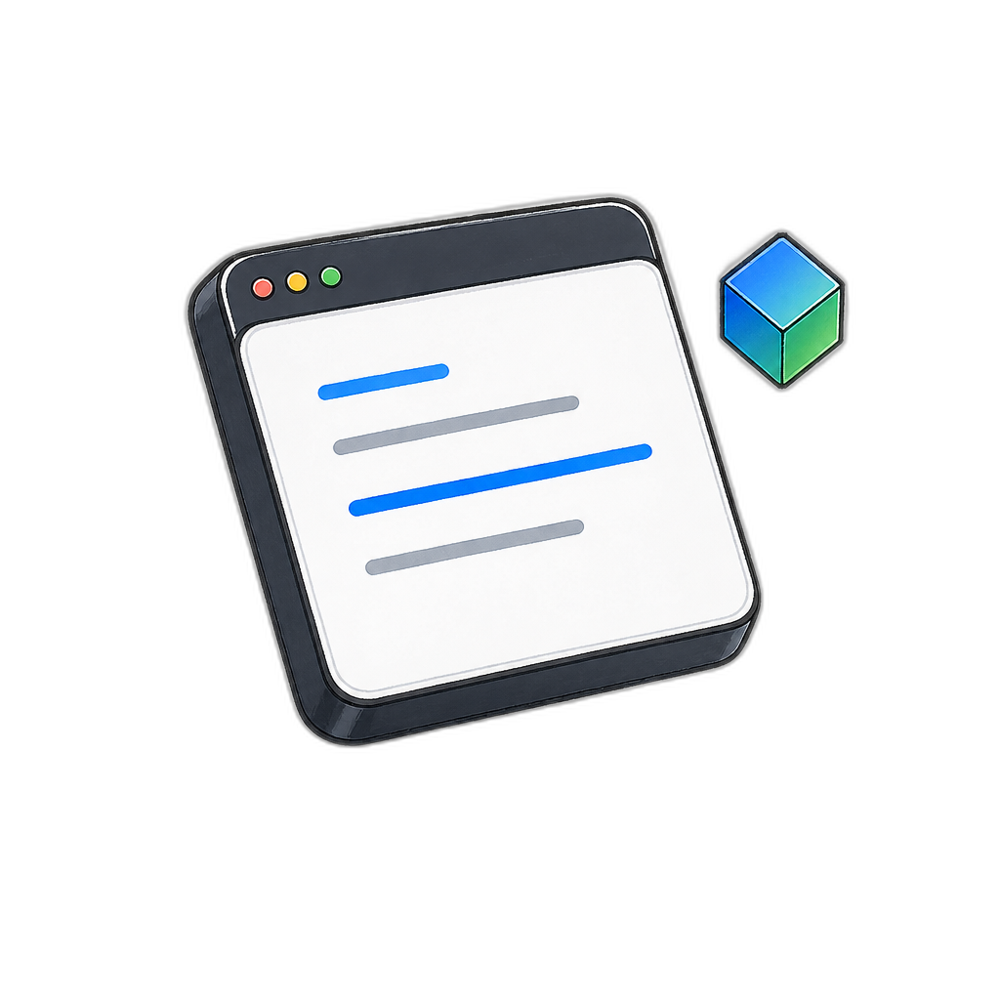

<div align="center">



# SnippetVault

**一款面向开发者的代码片段、笔记与 API 测试工具 —— 支持桌面端（Electron）与 Web/PWA 双端运行。**

<br>


<br>

[快速开始](#快速开始) · [核心能力](#核心能力) · [系统架构](#系统架构) · [界面展示](#界面展示)

</div>

<br>

## 核心能力

### 🧩 代码片段管理

- **CRUD 完整生命周期** — 创建、读取、更新、删除代码片段，支持标题、内容、语言、描述
- **智能搜索与筛选** — 全文搜索（标题 / 内容 / 语言 / 标签）、最近使用、高频使用、按标签筛选
- **标签系统** — 多对多关联，支持彩色标签与标签搜索
- **复制追踪** — 自动记录 `copy_count` 与 `last_used_at`，智能排序常用片段
- **代码执行沙箱** — 内置 HTML/CSS/JS  iframe 沙箱运行环境，支持控制台输出捕获
- **截图导出** — 类 Carbon 风格的代码截图生成器（渐变背景、窗口控件、2× PNG 导出）
- **导入/导出** — JSON 格式备份与恢复

### 📝 Markdown 笔记

- **三栏编辑模式** — 源码编辑 / 实时分屏 / 纯预览，可拖拽调整分屏比例
- **完整 Markdown 支持** — 基于 markdown-it + github-markdown-css 的渲染
- **自动保存** — 800ms 防抖自动保存，状态栏实时反馈
- **标签关联** — 与片段共享同一套标签体系
- **拖拽排序** — 笔记列表支持 HTML5 拖拽重排

### ⚡ HTTP 客户端

- **请求构建器** — 支持 GET/POST/PUT/PATCH/DELETE/HEAD/OPTIONS，头部表格编辑，请求体输入
- **环境变量** — `{{variable}}` 语法替换，支持 URL、Headers、Body 全链路注入
- **响应格式化** — 状态码、耗时统计、响应头部、JSON 自动格式化
- **原生 Fetch** — 浏览器标准 API，Electron 与 Web 端行为一致

### 🖥️ 桌面端专属

- **全局快启搜索** — `Ctrl+Shift+Space` 呼出 Spotlight 风格搜索面板，支持键盘导航与一键复制
- **系统托盘** — 常驻后台，左键呼出快启、右键菜单操作
- **本地 SQLite 数据库** — better-sqlite3 同步读写，零配置开箱即用

### 🌐 Web / PWA 专属

- **渐进式 Web 应用** — 支持离线访问、桌面安装、主题色与多分辨率图标
- **IndexedDB 本地存储** — 浏览器端数据持久化，无需后端
- **Service Worker** — Stale-While-Revalidate 缓存策略

---

## 界面展示

> 空状态插图 — 为三大模块定制的 Notion 风格 3D 手绘插图

Snippets 工作台 / Notes 写作角 / HTTP 连接桥，每幅插图均经过背景去除处理，在浅色与深色主题下均有统一卡片底座承载。

> 深色主题下的笔记模块 — 完整的深色模式适配，从编辑器到空状态插图

编辑器、侧边栏、状态栏、命令面板均支持实时主题切换。

---

## 快速开始

### 前置依赖

- Node.js `>= 18`
- npm `>= 9`

### 安装

```bash
git clone https://github.com/RollingTheRock/snippet-vault.git
cd snippet-vault
npm install
```

### 桌面端开发

```bash
# 启动 Electron 开发模式
npm run dev

# 构建生产版本
npm run build

# 打包为可执行文件（AppImage / dir）
npm run dist
```

### Web 端开发

```bash
# 启动 Web 开发服务器
npm run dev:web

# 构建 Web 静态包（输出到 dist-web/）
npm run build:web

# 预览生产构建
npm run preview:web
```

---

## 系统架构

### 双端统一代码库

同一套 Vue 3 代码同时运行在 Electron 桌面端与浏览器中，通过 `src/api/index.js` 透明路由：

| 平台 | 数据层 | 通信方式 |
|------|--------|----------|
| **桌面端** | better-sqlite3 | `window.electronAPI`（IPC） |
| **Web 端** | IndexedDB | `src/db/webDb.js`（原生 API） |

组件层完全无感知，无需条件判断。

### Electron 多窗口架构

| 窗口 | 尺寸 | 特性 |
|------|------|------|
| 主管理器 | 1200×760 | 无边框、隐藏替代关闭、ActivityBar 导航 |
| 快启搜索 | 640×400 | 居中、失焦自动隐藏、always-on-top |
| 预览窗口 | 自适应 | 沙箱隔离、可多开 |

### 安全 IPC 设计

- `contextIsolation: true` + `nodeIntegration: false`
- Preload 脚本通过 `contextBridge` 暴露最小化类型安全 API
- 所有数据库操作集中在主进程 Repository 层

### 前端技术栈

| 层级 | 技术 |
|------|------|
| 框架 | Vue 3（Composition API）+ Pinia |
| 构建 | Vite / electron-vite |
| 编辑器 | CodeMirror 6（15+ 语言动态加载） |
| Markdown | markdown-it + github-markdown-css |
| 截图 | html-to-image |
| 测试 | Playwright |

**CodeMirror 6 支持语言：** JavaScript · TypeScript · HTML · CSS · Vue · Python · Java · Go · Rust · C++ · C# · SQL · Shell · PHP · JSON · Markdown

---

## 仓库结构

```
snippet-vault/
├── electron/                  # Electron 主进程
│   ├── main.js               # 应用入口：托盘、窗口调度
│   ├── preload.js            # 安全上下文桥接
│   ├── windows/              # 窗口工厂（管理器 / 快启 / 预览）
│   ├── db/                   # SQLite 数据层
│   └── ipc/                  # IPC 通信处理
├── src/
│   ├── api/index.js          # 双端统一 API 抽象层
│   ├── db/webDb.js           # IndexedDB 浏览器数据层
│   ├── views/                # 页面级组件
│   │   ├── MainManager.vue   # 主管理器（ActivityBar + Sidebar + Editor + StatusBar）
│   │   └── QuickLaunch.vue   # 快启搜索面板
│   ├── components/           # 可复用组件
│   │   ├── CodeMirrorEditor.vue   # CodeMirror 6 封装（动态语言 / 自定义主题）
│   │   ├── MarkdownPreview.vue    # Markdown 预览
│   │   ├── CommandPalette.vue     # 全局命令面板（Ctrl+K）
│   │   ├── EmptyState.vue         # 模块空状态（3D 插图 + 浮动动画）
│   │   ├── CodeScreenshot.vue     # Carbon 风格代码截图生成
│   │   ├── ActivityBar.vue        # 垂直活动栏（48px）
│   │   └── SnippetList.vue        # 片段列表（拖拽排序 / 标签圆点）
│   ├── stores/               # Pinia 状态管理（snippets / notes / tags / http）
│   ├── composables/          # 组合式逻辑
│   │   ├── useTheme.js       # 浅色 / 深色主题切换
│   │   ├── useToast.js       # 全局 Toast 通知队列
│   │   ├── useGlowCursor.js  # 编辑器区域柔光光标跟随
│   │   └── useRipple.js      # Material 涟漪效果
│   └── styles/               # CSS 变量、深色主题、动画
├── public/
│   ├── illustrations/        # Notion 风格 3D 插图（透明背景 PNG）
│   ├── icon-*.png            # PWA 图标（96 / 192 / 512）
│   ├── favicon.svg           # 网站图标
│   ├── manifest.json         # Web App Manifest
│   └── sw.js                 # Service Worker
├── assets/                   # 系统托盘图标
└── docs/superpowers/         # 设计规范与开发文档
```

---

## 微交互系统

| 效果 | 说明 |
|------|------|
| `useGlowCursor` | 编辑器区域鼠标跟随的柔光晕（径向渐变） |
| `useRipple` | 主按钮的 Material 风格涟漪扩散 |
| `gentleFloat` | 空状态插图的 5s 周期悬浮动画 |
| `sidebar-slide` | 模块切换时的侧边栏滑入过渡 |
| `fade-slide` | 编辑器区域的淡入滑动切换 |
| `list` | 列表项的交错进入动画（基于 index 的 transitionDelay） |

---

## 当前约束与注意事项

- **CodeMirror chunk 体积** — 动态语言导入产生的 chunks 约 600KB，首次加载语言模块时存在体积警告，不影响功能。
- **CORS/CSP** — Web 模式下 HTTP 客户端需要 `connect-src *` 的 CSP 配置；Electron 端不受此限制。
- **Wayland** — Linux Wayland 环境下全局快捷键不可用，依赖托盘点击呼出快启搜索。
- **Tray 图标** — 当前统一使用浅色立方体图标，macOS 深色菜单栏显示良好；Windows 浅色任务栏建议补充深色版本。

---

## 参考文档

- `docs/superpowers/` — 设计规范与功能实现文档
- `AGENTS.md` — 开发规范与项目背景

---

## 许可证

[MIT License](LICENSE)

---

> 本项目为《Web 前端开发》课程作业，使用 Vue 3 + Electron 全栈开发。
