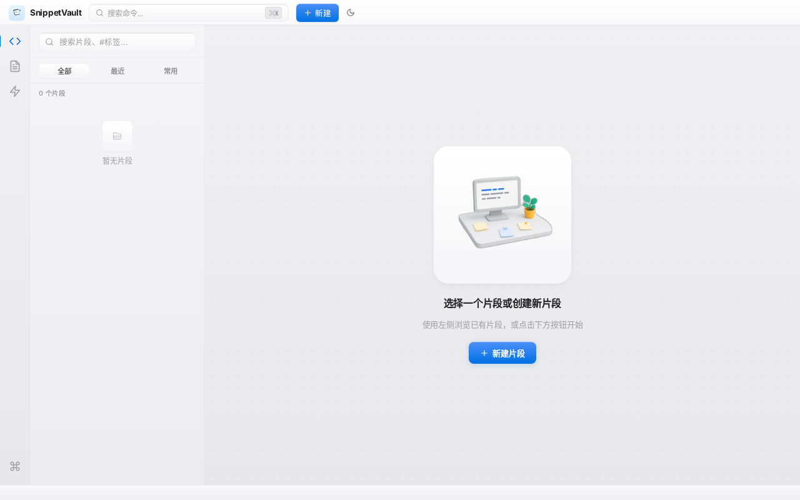
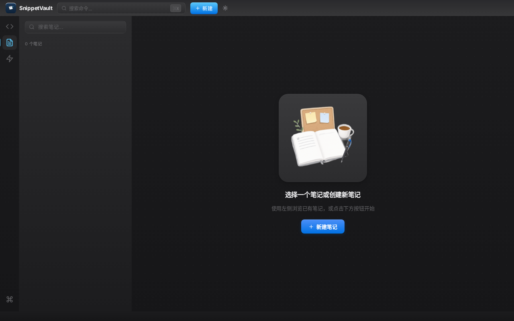
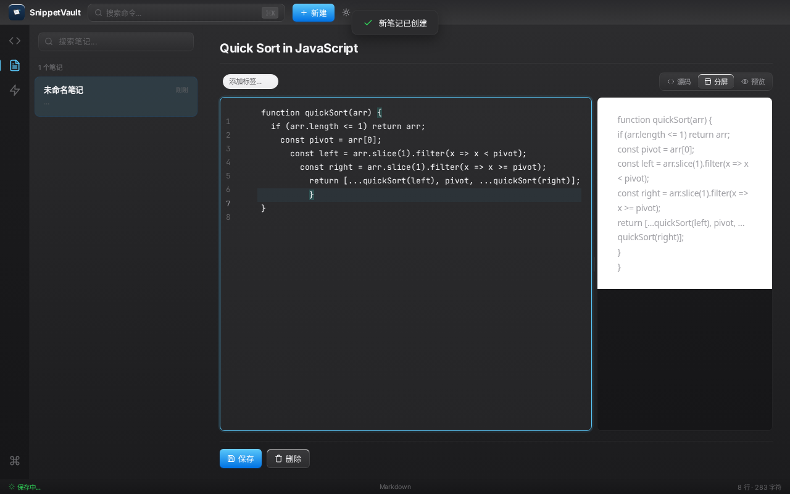
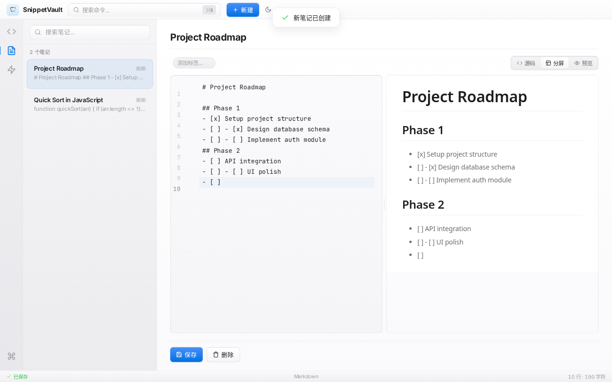
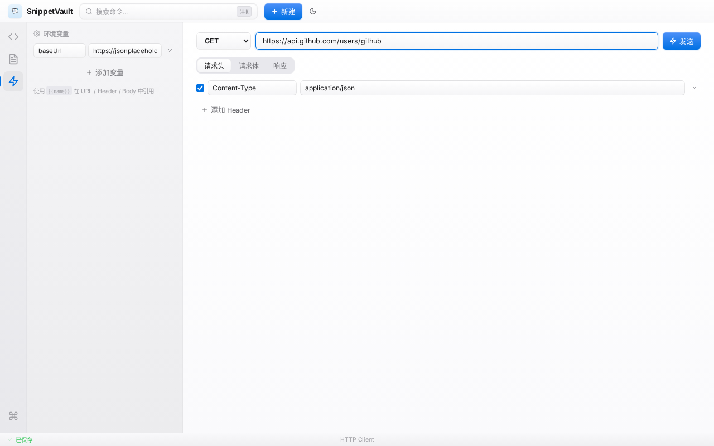
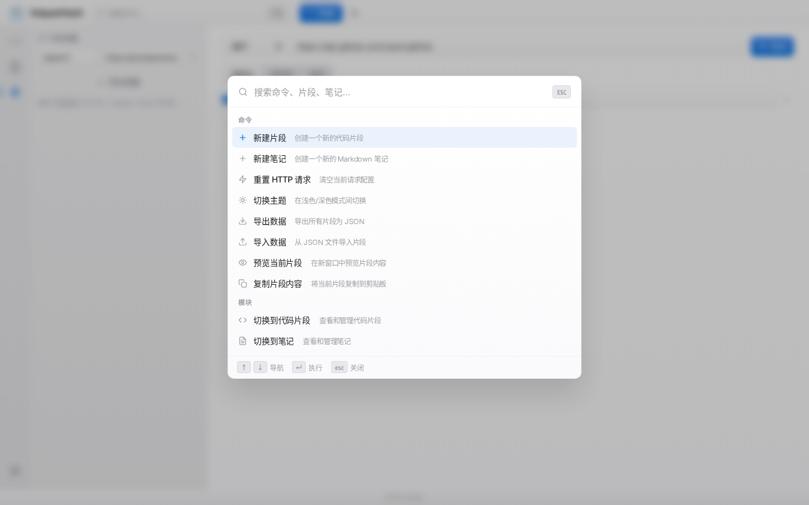

# SnippetVault — 课程作业说明

> 《Web 前端开发》课程作业  
> 仓库地址：https://github.com/RollingTheRock/snippet-vault

---

## 一、项目简介

SnippetVault 是一款面向开发者的效率工具，集成**代码片段管理**、**Markdown 笔记**与 **HTTP 客户端**三大模块。同一套 Vue 3 代码同时支持 **Electron 桌面端**（SQLite 本地存储）与 **Web/PWA**（IndexedDB 浏览器存储），实现真正的跨平台统一架构。

---

## 二、功能清单

### 代码片段
- 创建、编辑、删除、搜索片段（标题 / 内容 / 语言 / 标签）
- 标签系统（多对多关联、彩色标签）
- 复制追踪（自动统计使用频率与最近使用时间）
- 代码执行沙箱（HTML/CSS/JS iframe 实时运行）
- 代码截图导出（Carbon 风格，含渐变背景与窗口控件）
- JSON 导入/导出备份

### Markdown 笔记
- 三栏编辑模式：源码 / 分屏 / 预览
- 可拖拽调整分屏比例
- 800ms 防抖自动保存

### HTTP 客户端
- 支持 GET/POST/PUT/PATCH/DELETE/HEAD/OPTIONS
- 环境变量替换（`{{variable}}` 语法）
- 响应自动格式化（JSON + 耗时统计）

### 桌面端专属
- 全局快启搜索（`Ctrl+Shift+Space`）
- 系统托盘常驻
- 本地 SQLite 数据库

### Web/PWA 专属
- 渐进式 Web 应用（离线访问、桌面安装）
- Service Worker 缓存策略

---

## 三、技术栈

| 层级 | 技术 | 选型理由 |
|------|------|---------|
| 前端框架 | Vue 3 Composition API + Pinia | 响应式系统、组合式逻辑复用 |
| 构建工具 | Vite / electron-vite | 快速热更新、Electron 多进程构建 |
| 代码编辑器 | CodeMirror 6 | 模块化架构、动态语言加载、深度可定制 |
| Markdown | markdown-it + github-markdown-css | 标准渲染、GitHub 风格预览 |
| 桌面端 | Electron 30 + electron-builder | 跨平台打包、系统级集成 |
| 数据库（桌面）| better-sqlite3 | 同步读写、零配置 |
| 数据库（Web）| IndexedDB | 浏览器原生、无需后端 |
| 截图导出 | html-to-image | DOM 转 PNG，支持 CSS 样式 |

---

## 四、项目结构

```
snippet-vault/
├── electron/              # Electron 主进程
│   ├── main.js           # 应用入口（托盘、窗口调度）
│   ├── preload.js        # 安全上下文桥接
│   ├── windows/          # 窗口工厂（管理器/快启/预览）
│   ├── db/               # SQLite 数据层
│   └── ipc/              # IPC 通信处理
├── src/
│   ├── api/index.js      # 双端统一 API 抽象层
│   ├── db/webDb.js       # IndexedDB 浏览器数据层
│   ├── views/            # 页面级组件
│   ├── components/       # 可复用组件
│   │   ├── CodeMirrorEditor.vue   # CodeMirror 6 封装
│   │   ├── CommandPalette.vue     # 全局命令面板
│   │   ├── EmptyState.vue         # 空状态插图
│   │   └── CodeScreenshot.vue     # 代码截图生成
│   ├── stores/           # Pinia 状态管理
│   ├── composables/      # 组合式逻辑（主题/Toast/光标等）
│   └── styles/           # CSS 变量、深色主题、动画
├── public/               # 静态资源（插图、图标、PWA 配置）
└── docs/                 # 设计文档与截图
```

---

## 五、运行方式

### 方式一：浏览器预览（推荐）

进入 `02-Web效果包/` 目录：

```bash
# Windows
双击 start-web-server.bat

# Linux / macOS
./start-web-server.sh
```

脚本自动启动本地服务器并打开浏览器访问 `http://localhost:8080`。

> 注：现代浏览器禁止通过 `file://` 协议加载 ES 模块，若直接双击 `index.html` 会看到提示页面说明原因。

### 方式二：Linux 桌面端

```bash
chmod +x SnippetVault-1.0.0.AppImage
./SnippetVault-1.0.0.AppImage
```

### 方式三：源码开发

```bash
npm install
npm run dev:web      # Web 开发模式
npm run dev          # Electron 开发模式
```

---

## 六、关键技术实现点

### 1. 双端统一代码架构

`src/api/index.js` 通过运行时检测透明路由：

- **桌面端**：`window.electronAPI`（IPC 通信）→ `better-sqlite3`
- **Web 端**：`src/db/webDb.js`（IndexedDB）

组件层完全无感知，同一套 Vue 代码零分支同时运行在两种环境中。

### 2. CodeMirror 6 深度定制

- **动态语言加载**：15+ 语言按需 `import()`，避免打包体积膨胀
- **自定义主题**：独立设计 light/dark 两套 GitHub 风格语法高亮 + 编辑器主题
- **主题热切换**：销毁并重建编辑器实例实现无刷新换肤

### 3. 自定义 3D 插图系统

为三个模块空状态设计 Notion 风格 3D 手绘插图：
- 使用 rembg 进行背景去除，输出透明 PNG
- 深色/浅色主题下分别渲染圆角卡片底座承载插图
- 统一 gentleFloat 悬浮动画

### 4. 全局命令面板

`Ctrl+K` 触发的模态搜索：
- 模糊搜索覆盖命令、模块、片段、笔记
- 键盘导航（↑↓ 选择、Enter 执行、Esc 关闭）
- 分组渲染 + 选中项自动滚动

---

## 七、界面展示

### 代码片段空状态（浅色主题）



### 笔记空状态（深色主题）



### 代码编辑器（深色主题 + 语法高亮）



### Markdown 分屏编辑



### HTTP 客户端



### 全局命令面板


